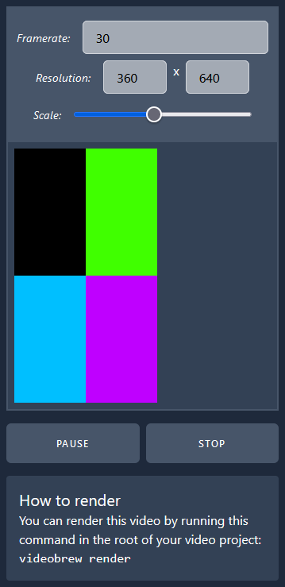
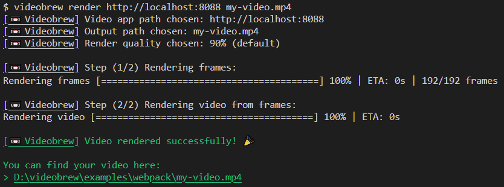

# 📼 Videobrew

<div align="center">

[](https://www.npmjs.com/package/@videobrew/cli)

</div>

Create videos using any web technologies (like Svelte, Vue and React) or just plain old HTML, CSS and Javascript. Animate your web page and have Videobrew render it to a video.

> <div align="center">
>
> ## 🚀 <span id="quickstart">Quickstart</span>
> *Start composing your videos with code!*
> 
> <hr>
>
> ### Install the CLI
> 
> ```bash
> $ npm i -g @videobrew/cli
> ```
> 
> <hr> 
>
> ### Create your video app
> Build a web page that describes the video. For now we'll  **serve the webpack example:**
> 
> ```bash
> $ cd examples/webpack
> $ npm run serve 
> # Webpack serves to http://localhost:8088
> ```
> 
> <hr> 
>
> ### Preview your video
> 
> ```bash
> # Let Videobrew know where to find your video app
> $ videobrew preview http://localhost:8088
> ```
> Open the editor in your browser @ http://localhost:8087
> 
> [](./docs/editor-previewing-video-app.png)
>
> <hr> 
>
> ### Render your video
>   
> ```bash
> $ videobrew render http://localhost:8088 my-video.mp4
> ```
>   
> [](./docs/cli-rendering-video-app.png)
> 
> <hr> 
>
> ### Done 🎉
>   
> Watch [📼 the video that Videobrew rendered](./examples/webpack/out/weather.mp4).
>
> <hr> 
>
> ### Next Steps
>
> Check out the [🧪 examples](#examples) to see how to use Videobrew with your favorite web technologies.
>
> Read the [📖 documentation](./docs/index.md) to learn how to [Code your own video](./docs/code-your-own-video.md)
>
> </div>

<hr>

## [📖 Documentation](./docs/index.md)

<hr>

## <span id="examples">🧪 Example Video Apps</span>
| Example | Description | Uses `@videobrew/client`
| ---: | --- | --- |
| [Zero Dependencies](./examples/0-dependencies/) | Just plain old HTML, CSS and Javascript. | |
| [Local Installation](./examples/local-install/) | Shows how to install and use Videobrew with `--save-dev` instead of globally with `-g`. | |
| <s>[ Sveltekit](./examples/sveltekit/)</s> (wip) | A Sveltekit video app example. | ✔ |
| [ Webpack +  TypeScript](./examples/webpack) | Use Webpack and TypeScript to make your video app. | ✔ |

<hr>

## License

> Videobrew - Create videos using any web technologies.
> 
> Copyright (C) 2023  Luttje
> 
> This program is free software: you can redistribute it and/or modify
> it under the terms of the GNU Affero General Public License as published
> by the Free Software Foundation, either version 3 of the License, or
> (at your option) any later version.
> 
> This program is distributed in the hope that it will be useful,
> but WITHOUT ANY WARRANTY; without even the implied warranty of
> MERCHANTABILITY or FITNESS FOR A PARTICULAR PURPOSE.  See the
> GNU Affero General Public License for more details.
> 
> A copy of the GNU Affero General Public License can be found [here](./LICENSE). 
> The full license text can also be found on <https://www.gnu.org/licenses/>.

### Third Party Licenses
> Licenses of third parties we are directly depending on can be found [here](./LICENSES-THIRD-PARTY). This file was automatically generated with [`license-checker-rseidelsohn`](https://www.npmjs.com/package/license-checker-rseidelsohn) upon running `npm run build`.