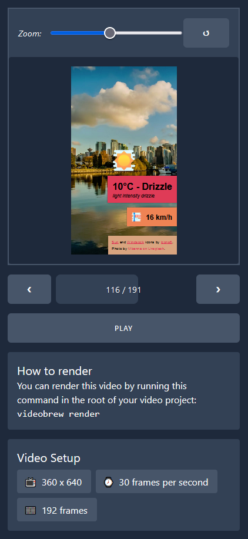

# 📼 Videobrew

<div align="center">

[](https://www.npmjs.com/package/@videobrew/cli)

</div>

Create videos using any web technologies (like Svelte, Vue and React) or just plain old HTML, CSS and Javascript. Animate your web page and have Videobrew render it to a video.

> <div align="center">
>
> ## 🚀 Quickstart
> *Start composing your videos with code!*
> 
> <hr>
>
> ### Install the CLI
> 
> ```bash
> $ npm i -g @videobrew/cli
> ```
> 
> <hr> 
>
> ### Create your video app
> Build a web page that describes the video. *For inspiration check out the [examples](#examples).*
> 
> <hr> 
>
> ### Preview your video
> 
> ```bash
> $ videobrew preview 
> ```
> 
> [](./docs/editor-previewing-video-app.png)
>
> *This editor is served @ http://localhost:8087*
> 
> <hr> 
>
> ### Render
>   
> ```bash
> $ videobrew render my-video.mp4
> ```
>   
> [](./docs/cli-rendering-video-app.png)
> 
> <hr> 
>
> ### Done 🎉
> See [the example video app](./examples/0-dependencies/) to learn how to make your own and watch [📼 the rendered video](./examples/0-dependencies/out/output.mp4) Videobrew created.
>   
> </div>

## 📖 Learn more

* [How to serve your video app yourself](./docs/serving-video-apps.md)
* [Documentation](./docs/index.md)

## <span id="examples">🧪 Example Video Apps</span>
| Example | Description |
| --- | --- |
| [Zero Dependencies](./examples/0-dependencies/) | Just plain old HTML, CSS and Javascript. |
| <s>[Sveltekit](./examples/sveltekit/)</s> (wip) | A Sveltekit app. |

## License

> Videobrew - Create videos using any web technologies.
> 
> Copyright (C) 2023  Luttje
> 
> This program is free software: you can redistribute it and/or modify
> it under the terms of the GNU Affero General Public License as published
> by the Free Software Foundation, either version 3 of the License, or
> (at your option) any later version.
> 
> This program is distributed in the hope that it will be useful,
> but WITHOUT ANY WARRANTY; without even the implied warranty of
> MERCHANTABILITY or FITNESS FOR A PARTICULAR PURPOSE.  See the
> GNU Affero General Public License for more details.
> 
> A copy of the GNU Affero General Public License can be found [here](./LICENSE). 
> The full license text can also be found on <https://www.gnu.org/licenses/>.

### Third Party Licenses
> Licenses of third parties we are directly depending on can be found [here for the CLI](./packages/cli/LICENSES-THIRD-PARTY) and [here for the editor](./packages/editor/LICENSES-THIRD-PARTY). These files were automatically generated with [`license-checker-rseidelsohn`](https://www.npmjs.com/package/license-checker-rseidelsohn) upon building.